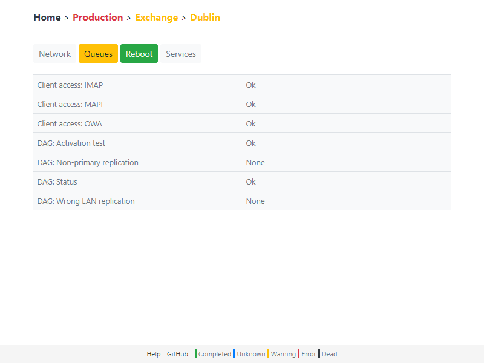
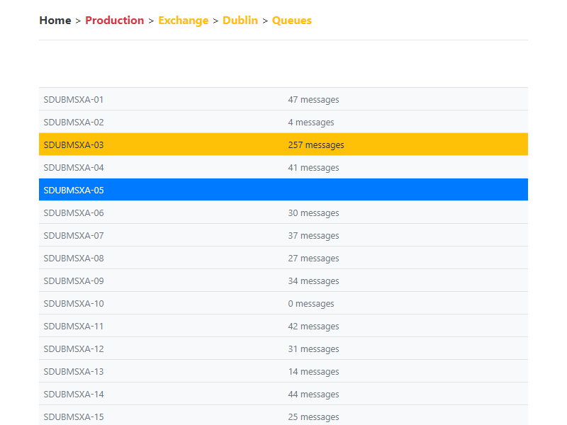

# minitor
Minitor is a lightweight status dashboard for distributed systems.

It receives updates from other systems or components, and broadcasts status changes to viewing web browsers in real time.

Status updates are sent via HTTP using simple and standard tools (e.g. curl, PowerShell, wget) or from any programing language.

Setup and configuration are not required.

Patforms:
- Linux with [.NET Core 2](https://www.microsoft.com/net) and later
- macOS with [.NET Core 2](https://www.microsoft.com/net) and later
- Windows 8 / Windows Server 2012 and later

Minitor is a work in progress, issues and feedback are welcome and appreciated.

---

### Find out more
- [Quick start](docs/start.md)
- [Use cases](docs/usage.md)
- [Parameters reference](docs/reference.md)
- [Examples](docs/examples.md)
- [Next steps](docs/next.md)
