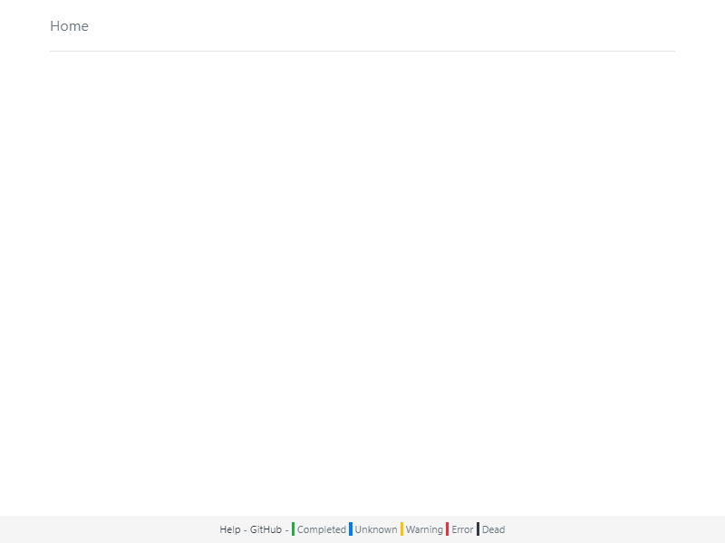

This page walks through a test run of minitor, and shortly describes how it works.

# Requirements

Please make sure you have installed the required components.

- On Linux and macOs, you will need [.NET Core 2.0](https://www.microsoft.com/net) or later
- Windows 8/2012 and later already come with the required .NET Framework version

You may also need root/administrator priviledges, see below for HTTP port security restrictions..

# Starting the server

Minitor is a single file deployment that can be copied to your location of choice, you can clone and build from GitHub or download a compressed release.

- On Linux and macOS the executable file is named `minitor.dll`
- On Windows it is `minitor.exe`

Then open a command prompt or terminal and make sure your current directory is the location of `exe` or `dll` file.

- On Linux and macOS run command `dotnet minitor.dll server`
- On Windows run `minitor server`

Administrator priviledges are required on Windows to run minitor Release builds as they use default HTTP port 80 which is protected, if you are not admin (or do not run from an elevated command prompt) you will see `Access denied` errors.

The Debug build defaults to port 12345 to ease development and debugging, you may wish to use that to test as well.

[console screenshot]

# Opening a client

Any modern browser should do, minitor is tested with current Chrome, IE and Safari versions.

Navigate to http://localhost for a Release build, or http://localhost:12345 for a Debug build.

If all is well, you will see the following page:



In case of troubles, you may want to check your firewall settings or check if another web server is already running.

# Sending a basic status

Any tool or script capable of sending a web request will do. In the following examples change the port number as needed
depending on which build you are using.

Open a command prompt or terminal.

### Linux/macOS

We will use `curl`:
```
curl "http://localhost/set?monitor=Hello&text=There&status=warning"
```

### Windows

Using `PowerShell`:
```
PowerShell -c "iwr 'http://localhost/set?monitor=Hello&text=There&status=warning'"
```
`iwr` is a shortcut or alias for `Invoke-WebRequest`.


### What happened

We sent a request to minitor to create or update a monitor named `Hello` with descriptive text `There` and status `warning`. This monitor is now visible in your browser and in any other connected client:

[web page screenshot]

Try replacing the `text` parameter, or changing `status` to either `normal` or `error`.

Note that you could use these status update URLs directly in your browser.

# Advanced status update

### Hierarchy

Minitor is not a single page. Try using sub URLs like:
```
http://localhost/set/Production/Servers/SRV0001?monitor=Disk%20free&text=120.5GB
```
Notice how navigation dynamically appears on pages and how status of child pages is reflected in navigation UI.

### Status values

There are more possible values for `status`, see [parameters reference](reference.md).

### Timeouts

You may notice that your updates turn blue after a while, and disappear after even longer.
Minitor uses some default timeouts that can be configured in each request, see [parameters reference](reference.md).

### Complex text

If your text may contain spaces or non-alphanumeric characters, you will need to URLencode it.
This is achieved as such:
```
curl -G -v "http://localhost/set" --data-urlencode "monitor=hello world" --data-urlencode "text=some long text"
```
Or:
```
PowerShell -C "irm 'http://localhost/set' -Body @{ monitor='hello world'; text='some long text'; }"
```
Notice the use of single and double quotes for PowerShell.

`irm` is a shortcut or alias for `Invoke-RestMethod`, which might be easier to use than `Invoke-WebRequest` in some scripts.

### Abbreviations

All parameters and status values can be abbreviated down to their shortest form. So:
```
curl "http://localhost/set?monitor=Hello&text=There&status=warning"
```
is equivalent to:
```
curl "http://localhost/set?mon=Hello&text=There&st=warn"
```
or even:
```
curl "http://localhost/set?m=Hello&t=There&s=w"
```
# Next

Minitor is a specialized tool and has many limitations, please have a look at [use cases](usage.md) to make sure it suits your needs.

URL parameters are detailed in [parameters reference](reference.md), and there are [examples](examples.md).

Last, please get in touch for any feedback, issue or suggestion.
